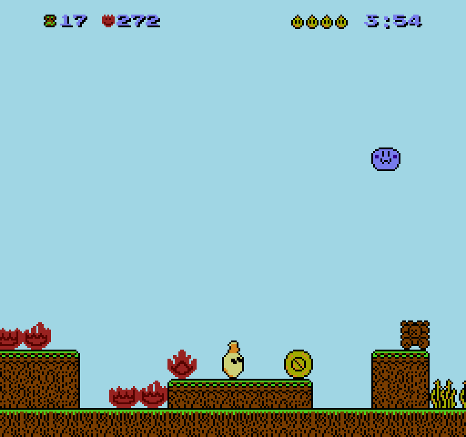
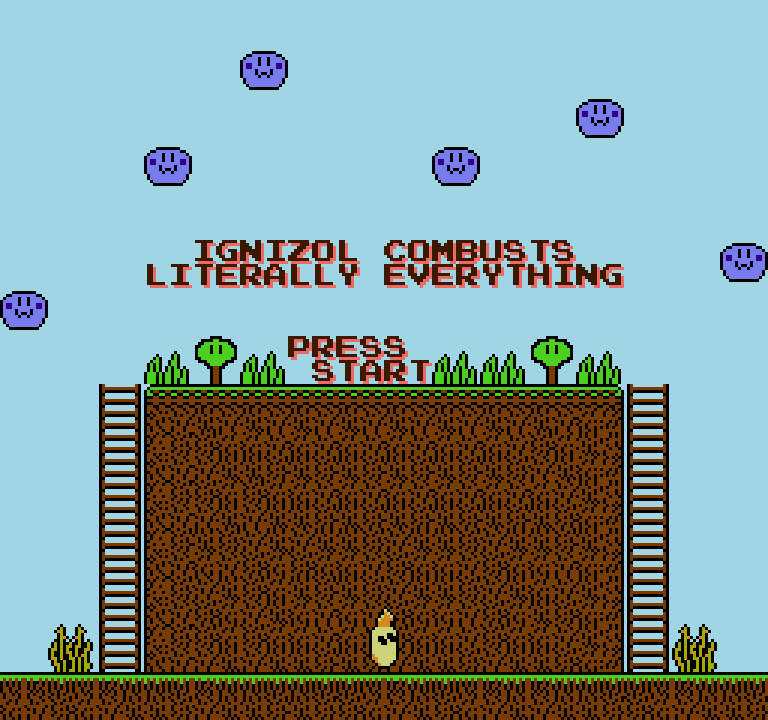

<div align="center">

# 🎮 NES on an STM32

**A Nintendo Entertainment System — the "Pegasus" of Polish living rooms —
emulated from scratch on a €40 microcontroller board. No operating system,
no emulator library, no shortcuts.**



*Straight out of the hardware: this frame was read from the
microcontroller's framebuffer over SWD while the game was running on the
board — not rendered afterwards on a PC.*

</div>

---

## The game that runs on it



The guest of honour is a **real NES cartridge**:
[**Ignizol Combusts Literally Everything**](https://github.com/pcrain/ignizol-combusts-literally-everything),
a 40 KiB "burn-em-up" written in 6502 assembly by **Captain Pretzel
(Patrick Crain)** — eight levels, as many particle effects as the NES can
survive, an original soundtrack, and a small fire demon who sets the whole
level alight. It is homebrew and freely licensed under the **GPL-3.0**,
which is exactly why it can be the guest of honour here: commercial ROM
images stay out of this repository, and so does this one (the build embeds
whatever cartridge you point it at, locally).

Technically it is a plain NROM cartridge: 32 KB of PRG ROM, 8 KB of CHR,
vertical mirroring, no bank switching. It is, however, a *real* game — it
hammers the scroll registers mid-frame, races the beam with sprite 0 to
split its status bar off, and generally does everything a cartridge does
that a hand-written test program never thinks of. That is what made it
valuable: it found bugs the self-test cartridge was too polite to find.

## What is this?

An NES emulator small enough to live on a **NUCLEO-L476RG** (Cortex-M4F,
80 MHz, 1 MB of flash, 96 KB of RAM) with an **X-NUCLEO-GFX01M2** display
shield (a 240×320 ST7789 panel on SPI).

Everything is written from scratch in C:

- a **6502 CPU core** (the NES's processor — every official opcode plus
  the undocumented ones real games use),
- a **PPU** — a scanline renderer for the picture chip: tiles, palettes,
  sprites, scrolling, sprite-0 hit, NMI,
- the **machine** around them: the memory map with all of its mirroring
  quirks, the cartridge (iNES), the controller, OAM DMA,
- the **mappers** that switch banks while the game runs: NROM, MMC1 and
  MMC3 — the last one including its scanline-counter interrupt, the trick
  games use to split the screen between a status bar and a playfield.

The self-test cartridge that the project grew up with is generated by this
repository as well — its font and artwork are drawn in Python, so the whole
project is original work.

## What had to be fixed before a real game would run

A hand-written test cartridge was passing long before a real game was
playable. Running one exposed the bugs that only real code finds; every
row below is a chapter of [docs/BRINGUP.md](docs/BRINGUP.md), with the
debugging story and the fix.

| What you saw | What it actually was |
|---|---|
| The game froze a second after the level started — while the emulator cheerfully kept rendering 17 frames per second | The PPU raised the **sprite-0 hit** flag and never lowered it. Games poll that flag to find out where the beam is; the real chip clears it once per frame, at the pre-render line. With a sticky flag the game spun forever in its first waiting loop. |
| The picture jumped left and right while walking, and the character slid over scenery it was not standing on | The scroll is not one value. Its **vertical half** is loaded once per frame, but its **horizontal half is reloaded on every scanline** — that is what lets a game give the status bar one scroll and the playfield below it another. The emulator only did the per-frame half, so the level kept the status bar's coarse scroll while only the fine part followed the camera: a sawtooth inside eight pixels instead of a camera. |
| The joystick worked, but "up" walked right, "down" walked left and "left" jumped | The pin map had been measured with the board held upright; the emulator draws in landscape, the board is turned a quarter turn, and the joystick turns with it. The map was not wrong — it had been measured in a different pose. |
| The picture sat 22 scanlines too low and wrapped into an empty nametable | The VRAM address register `v` was being advanced during vblank; the real PPU only advances it while visible lines are drawn. |
| The emulated CPU ran 4.6× too fast | Frame pacing: the CPU gets 113.67 cycles per scanline and has to wait for the picture, like the real one does. |
| Tiles that looked plausible and were still wrong | The renderer fetched nametable and attribute bytes from the wrong place — the kind of bug a screenshot comparison catches and a code review does not. |
| Nothing on the panel at all, then a picture shifted by 8 bytes | Three separate bring-up bugs in the display path: DMA register offsets off by 8, a single DMA channel that cannot double-buffer, and a window offset. |

Two habits did most of the work, and both are reproducible from this
repository:

- **the same emulator runs on a PC.** `make host-rom ROM=<cartridge>` runs
  the identical `cpu6502.c` / `ppu.c` / `nes.c` on the host and dumps a
  frame, so a bug can be reproduced, instrumented and A/B-tested in
  seconds instead of one flash at a time. Every hardware fix in the list
  above was first understood on the PC;
- **the board can be inspected while it runs.** The framebuffer is read out
  over SWD (that is where the screenshots come from), the emulated 6502's
  registers are plain variables in `.bss` and can be read live, and the
  joystick can even be driven from the debugger by pulling the GPIO pins
  low — which is how the control mapping was verified without a hand on
  the stick.

## Why it is interesting

| Challenge | What had to happen |
|---|---|
| The NES draws 60 frames per second; the display link alone takes 12 ms per frame | the picture is streamed out in 8-scanline bands by DMA **while** the next band is being emulated |
| 96 KB of RAM, and the NES wants a framebuffer | an 8-bit indexed framebuffer holding the 64 NES colours, 61 KB of it |
| The CPU has to feel like a 1.79 MHz 6502 | a cycle-counted core, paced per scanline (113.67 cycles per line) |
| Games change the scroll registers in the middle of a frame | the PPU renders one scanline at a time, exactly between the CPU's slices, and reloads the horizontal scroll per line |

**Current speed: ~17 frames per second** at the full 256×240 resolution.
That is the honest number: the emulation is correct, the picture is
verified pixel-for-pixel against the PC build, but a 60 fps game runs at
roughly a third of its speed on this microcontroller
(see [docs/PERFORMANCE.md](docs/PERFORMANCE.md)).

## Layout

```
src/cpu6502.c      the 6502 core (dispatch generated by tools/gen_6502.py)
src/ppu.c          the picture chip: scanline renderer, sprites, scrolling
src/nes.c          the machine: bus, cartridge, controller, frame loop
src/lcd.c          landscape display, band streaming over SPI DMA
src/hal.c          the only file that touches hardware registers
src/rom_data.c     the cartridge, embedded (generated)
tools/             assembler, ROM generator, host test rigs
```

## Try it

You need the two boards and the Arm toolchain — everything else is in the
repository:

```bash
make                     # firmware with the self-test cartridge
make flash               # write it to the board and reset

make ROM=mygame.nes flash   # or embed any NROM/MMC1 cartridge you own
```

Then hold the board in landscape, USB sockets to the left. The joystick
turns with the board, so the emulator's map is a quarter turn from the
upright one ([why](docs/ARCHITECTURE.md#the-pad-inputc)):

| NES button | On the board |
|---|---|
| D-pad | the joystick, in the direction you are looking at |
| **A** | the blue button |
| **B** | blue button + joystick down |
| **START** | blue button + joystick up (press this to start a game) |

More detail in [docs/BUILD.md](docs/BUILD.md).

## The documentation

- [docs/ARCHITECTURE.md](docs/ARCHITECTURE.md) — how the emulator is put
  together, layer by layer, and how the two chips are kept in sync.
- [docs/BRINGUP.md](docs/BRINGUP.md) — the war stories: thirteen bugs,
  from a DMA channel that could not double-buffer to a sprite-0 flag that
  hung a game a second after it started.
- [docs/PERFORMANCE.md](docs/PERFORMANCE.md) — where the 57 ms of a frame
  actually go, and what was optimised (and what is next).

## Status

- [x] 6502 core, verified with a self-test program on the PC
- [x] PPU: background, sprites, scrolling, NMI, sprite-0 hit, mid-frame
      scroll changes
- [x] NROM, MMC1 and MMC3 cartridges (8 KB/1 KB banking, the MMC3
      scanline IRQ, all four nametable arrangements), embedded in flash
- [x] A real homebrew cartridge running, joystick and all
- [x] A commercial-era MMC3 cartridge (Contra 2 / Super C) running on the
      board, frame-for-frame identical to the PC build
- [x] Picture on the real panel, streamed by DMA
- [x] The hardware picture is verified against a PC reference frame
- [ ] Later mappers (VRC, MMC5, ...)
- [ ] Audio (the chip has a DAC; the shield has no speaker yet)
- [ ] Faster than 17 fps

## Licence

The emulator is **MIT** — see [LICENSE](LICENSE). It contains no
third-party code and no ROM images: the three test cartridges are
generated from the Python sources in `tools/` (`make rom`, `--mmc1`,
`--mmc3`), and a real cartridge is embedded locally at build time and
never committed. The MMC3 support was developed against a cartridge from
its owner's own shelf, which is why there is no screenshot of it here.

The two screenshots are frames of *Ignizol Combusts Literally Everything*
by Captain Pretzel (Patrick Crain), used with attribution; the game and its
artwork are **GPL-3.0** (its own credits note the graphics adapted from
Nintendo titles), which is why they are the only images here that are not
covered by the MIT licence above.

<div align="center">

*Built by Przemysław Batte. Long live the Pegasus.*

</div>
