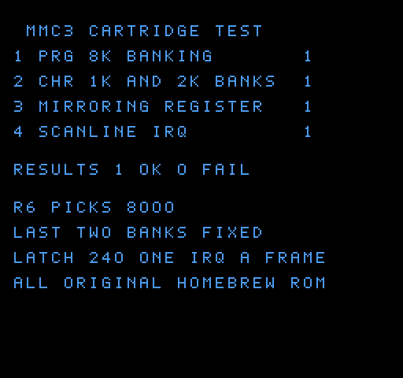

<div align="center">

# 🎮 NES on an STM32

**A Nintendo Entertainment System — the "Pegasus" of Polish living rooms —
emulated from scratch on a €40 microcontroller board. No operating system,
no emulator library, no shortcuts.**


*Straight out of the hardware: this frame was read from the
microcontroller's framebuffer over SWD while the game was running on the
board — not rendered afterwards on a PC.*

</div>

---

## The game that runs on it


The guest of honour is a **real NES cartridge**:
[**Ignizol Combusts Literally Everything**](https://github.com/pcrain/ignizol-combusts-literally-everything),
a 40 KiB "burn-em-up" written in 6502 assembly by **Captain Pretzel
(Patrick Crain)** — eight levels, as many particle effects as the NES can
survive, an original soundtrack, and a small fire demon who sets the whole
level alight. It is homebrew and freely licensed under the **GPL-3.0**,
which is exactly why it can be the guest of honour here: commercial ROM
images stay out of this repository, and so does this one (the build embeds
whatever cartridge you point it at, locally).

Technically it is a plain NROM cartridge: 32 KB of PRG ROM, 8 KB of CHR,
vertical mirroring, no bank switching. It is, however, a *real* game — it
hammers the scroll registers mid-frame, races the beam with sprite 0 to
split its status bar off, and generally does everything a cartridge does
that a hand-written test program never thinks of. That is what made it
valuable: it found bugs the self-test cartridge was too polite to find.

Four more cartridges have since been on the board, three of them MMC3; they
are in the table [below](#what-has-been-run-on-it).

## What is this?

An NES emulator small enough to live on a **NUCLEO-L476RG** (Cortex-M4F,
80 MHz, 1 MB of flash, 96 KB of RAM) with an **X-NUCLEO-GFX01M2** display
shield (a 240×320 ST7789 panel on SPI).

Everything is written from scratch in C:

- a **6502 CPU core** (the NES's processor — every official opcode plus
  the undocumented ones real games use),
- a **PPU** — a scanline renderer for the picture chip: tiles, palettes,
  sprites, scrolling, sprite-0 hit, NMI,
- the **machine** around them: the memory map with all of its mirroring
  quirks, the cartridge (iNES), the controller, OAM DMA,
- the **mappers** that switch banks while the game runs: NROM, MMC1,
  UxROM and MMC3 — the last one including its scanline-counter interrupt,
  the trick games use to split the screen between a status bar and a
  playfield.

The self-test cartridge that the project grew up with is generated by this
repository as well — its font and artwork are drawn in Python, so the whole
project is original work.

## What real code exposed

A hand-written test cartridge was passing long before a real game was
playable. Running one exposed the bugs that only real code finds; every
row below is a chapter of [docs/BRINGUP.md](docs/BRINGUP.md), with the
debugging story and the fix.

| What you saw | What it actually was |
|---|---|
| The game froze a second after the level started — while the emulator cheerfully kept rendering 17 frames per second | The PPU raised the **sprite-0 hit** flag and never lowered it. Games poll that flag to find out where the beam is; the real chip clears it once per frame, at the pre-render line. With a sticky flag the game spun forever in its first waiting loop. |
| The picture jumped left and right while walking, and the character slid over scenery it was not standing on | The scroll is not one value. Its **vertical half** is loaded once per frame, but its **horizontal half is reloaded on every scanline** — that is what lets a game give the status bar one scroll and the playfield below it another. The emulator only did the per-frame half, so the level kept the status bar's coarse scroll while only the fine part followed the camera: a sawtooth inside eight pixels instead of a camera. |
| The joystick worked, but "up" walked right, "down" walked left and "left" jumped | The pin map had been measured with the board held upright; the emulator draws in landscape, the board is turned a quarter turn, and the joystick turns with it. The map was not wrong — it had been measured in a different pose. |
| The picture sat 22 scanlines too low and wrapped into an empty nametable | The VRAM address register `v` was being advanced during vblank; the real PPU only advances it while visible lines are drawn. |
| The emulated CPU ran 4.6× too fast | Frame pacing: the CPU gets 113.67 cycles per scanline and has to wait for the picture, like the real one does. |
| Tiles that looked plausible and were still wrong | The renderer fetched nametable and attribute bytes from the wrong place — the kind of bug a screenshot comparison catches and a code review does not. |
| Nothing on the panel at all, then a picture shifted by 8 bytes | Three separate bring-up bugs in the display path: DMA register offsets off by 8, a single DMA channel that cannot double-buffer, and a window offset. |
| Horizontal stripes in the lower, static part of a dungeon screen, looking like copies of the band above them | The band-skip decision compared each band against the band *above* it, not against what the panel held — so bands the panel had never been given were skipped, and it kept older content permanently. |

Three habits did most of the work, and all are reproducible from this
repository:

- **the same emulator runs on a PC.** `make host-rom ROM=<cartridge>` runs
  the identical `cpu6502.c` / `ppu.c` / `nes.c` on the host and dumps a
  frame, so a bug can be reproduced, instrumented and A/B-tested in
  seconds instead of one flash at a time. Every hardware fix in the list
  above was first understood on the PC;
- **the board can be inspected while it runs.** The framebuffer is read out
  over SWD (that is where the screenshots come from), the emulated 6502's
  registers are plain variables in `.bss` and can be read live, the
  per-frame cost of every stage is published there once a frame
  (`tools/swd.py`), and the joystick can even be driven from the debugger by
  pulling the GPIO pins low — which is how the control mapping was verified
  without a hand on the stick;
- **the firmware checks itself.** A display bug is invisible in the
  framebuffer — the panel has no readback on this shield — so the boot path
  verifies its own colour conversion against bytes worked out by hand, its
  fast band-skip decision against an obvious byte-wise one, and, on demand,
  every skip against a fingerprint of what the panel was last given
  ([story 18](docs/BRINGUP.md)).

## Why it is interesting

| Challenge | What had to happen |
|---|---|
| The NES draws 60 frames per second; the display link alone takes 24.6 ms per frame | the picture is streamed out in 4-scanline bands by DMA **while** the next band is emulated, and a band the panel already holds is not sent at all |
| 96 KB of RAM, and the NES wants a framebuffer | an 8-bit indexed framebuffer holding the 64 NES colours, 61,440 bytes of it |
| The CPU has to feel like a 1.79 MHz 6502 | a cycle-counted core, paced per scanline (113.67 cycles per line), with its registers in true locals — 102 host cycles per emulated instruction |
| Games change the scroll registers in the middle of a frame | the PPU renders one scanline at a time, exactly between the CPU's slices, and reloads the horizontal scroll per line |
| Games split the screen at a scanline the PPU never announces | the MMC3's scanline counter is clocked by the rendered lines and raises a real IRQ a game can aim at |

**Current speed: 20.3–21.0 ms a frame — 47–48 fps — in Prince of Persia's
light scenes, 33 ms (30 fps) in its heavy ones.** That is the honest number:
the emulation is correct and the picture is verified byte-for-byte against
the PC build, but the wall is the display link itself. 122,880 bytes a frame
at 40 MHz SPI is 24.6 ms of wire time, so no amount of CPU work takes this
build much past **45 fps** (see [docs/PERFORMANCE.md](docs/PERFORMANCE.md)).

## Layout

```
src/cpu6502.c      the 6502 core (dispatch generated by tools/gen_6502.py)
src/ppu.c          the picture chip: scanline renderer, sprites, scrolling
src/nes.c          the machine: bus, cartridge, controller, frame loop
src/mapper.c       NROM, MMC1, UxROM, MMC3 (and the MMC3 scanline IRQ)
src/lcd.c          landscape display: 4-line bands over SPI DMA, unchanged bands skipped
src/hal.c          the only file that touches hardware registers
src/rom_data.c     the cartridge, embedded (generated)
tools/             assembler, ROM generator, host test rigs, SWD tools
```

## Try it

You need the two boards and the Arm toolchain — everything else is in the
repository:

```bash
make                     # firmware with the self-test cartridge
make flash               # write it to the board and reset

make ROM=mygame.nes flash   # or embed any NROM/MMC1/UxROM/MMC3 cartridge you own
make LCD_12BIT=1            # the same firmware in RGB444 (25% less wire time, not faster yet)
```

Then hold the board in landscape, USB sockets to the left. The joystick
turns with the board, so the emulator's map is a quarter turn from the
upright one ([why](docs/ARCHITECTURE.md#the-pad-inputc)):

Four directions and one button have to cover the NES's eight, so the
blue button means different things in combination — and which of A and B
it carries depends on a layout chosen **at reset**:

| NES button | gamepad layout (default) | shooter layout (hold blue at reset) |
|---|---|---|
| D-pad | the joystick, in the direction you are looking at | same |
| **A** | blue button | blue button + joystick up |
| **B** | blue button + joystick down | blue button |
| **START** | blue button + joystick up, held | blue button + joystick down, held |

The default suits games that act on A (jump, Mario-style); the shooter
layout puts **fire** on the bare button, because in a game like Contra
that is the button you hold down the whole time while running, and it
cannot live on a combination. START always needs its combination *held* for
12 frames — about a third of a second at the speed above — so that a quick
tap of fire while ducking does not pause the game.

More detail in [docs/BUILD.md](docs/BUILD.md). A real gamepad is the
project's next hardware step; see [What is next](#what-is-next).

## What has been run on it

Cartridges from the shelf, none of them included in this repository. Each
one was checked the same way: the same frame on the PC and on the board,
compared byte for byte (`0 differing bytes` of 61,440 means the board's
framebuffer is identical to the reference build).

| Cartridge | Mapper | On the board |
|---|---|---|
| Ignizol Combusts Literally Everything (homebrew, GPL-3.0) | NROM | plays; screenshots above; 0 differing bytes |
| Contra 2 / Super C | MMC3 | plays; 0 differing bytes on the AREA 1 screen; **never enables the MMC3 IRQ** |
| The Lion King 3 — Timon & Pumbaa | MMC3 | plays; 0 differing bytes; splits its status bar with the MMC3 IRQ, which fires on the scanline the game asks for |
| Mario 16 | MMC3 | plays; 0 differing bytes on the title screen |
| Prince of Persia (PL) | UxROM | plays; 0 differing bytes on the title screen; 8 KB CHR **RAM** |
| Castlevania III — Dracula's Curse | MMC5 | plays, from the title screen through the intro into the level; drives PRG mode 2, 1 KB CHR banks, $5105 = $44/$50/$55/$E4 (so ExRAM and fill as nametable sources), ExRAM mode 0, direct ExRAM writes and the scanline IRQ at $5203 = 8; 0 differing bytes at emulated frames 300/400/500/620 |

The three self-test cartridges in `tools/` cover the same ground without
any third-party code: NROM (`make rom`), MMC1
(`python3 tools/make_test_rom.py --mmc1`) and MMC3 (`--mmc3`). The MMC3 one
checks 8 KB PRG banking, 1 KB and 2 KB CHR banking, both mirroring modes and
the scanline IRQ — six sub-tests, one bit each in `$030F`, which reads `$3F`
on the host and on the board:



*The project's own MMC3 cartridge: four result lines, six checks, all
passing. The same image on the board and on the PC.*

## The documentation

- [docs/ARCHITECTURE.md](docs/ARCHITECTURE.md) — how the emulator is put
  together, layer by layer, how the two chips are kept in sync, and what the
  display path checks about itself.
- [docs/BRINGUP.md](docs/BRINGUP.md) — the war stories: eighteen of them,
  from a DMA channel that could not double-buffer, through a register cache
  that helped the host and not the board, to a band-skip decision that
  compared the wrong band and a panel that cannot be read back.
- [docs/PERFORMANCE.md](docs/PERFORMANCE.md) — where a frame goes now, what
  each optimisation cost and bought, what was measured and dropped, and why
  the display link rather than the CPU is the ceiling.
- [docs/BUILD.md](docs/BUILD.md) — the toolchain, the test targets, the
  12-bit build, and how to verify a frame on the board.

## Status

- [x] 6502 core, verified with a self-test program on the PC, an exhaustive
      opcode sweep and a differential harness (35 million random
      instructions against a core built from a git revision)
- [x] PPU: background, sprites, scrolling, NMI, sprite-0 hit, mid-frame
      scroll changes
- [x] NROM, MMC1, UxROM and MMC3 cartridges (8 KB/1 KB banking, CHR RAM,
      the MMC3 scanline IRQ, all four nametable arrangements), embedded in
      flash
- [x] Five real cartridges running on the board, each frame-for-frame
      identical to the PC build (see the table above)
- [x] Picture on the real panel, streamed by DMA in 4-line bands, with
      unchanged bands skipped
- [x] The firmware checks its own colour conversion and band decisions at
      boot, and its counters can be read live over SWD
- [x] Past the old 17 fps: 47–48 fps in a light scene, 30 in a heavy one —
      against a display link that caps this at roughly 45 fps
- [ ] A real gamepad (see [What is next](#what-is-next))
- [ ] Later mappers (VRC, MMC5, ...)
- [ ] Audio (the chip has a DAC; the shield has no speaker yet)

## What is next

**A proper gamepad.** Five switches and two layouts are a workaround for the
NES's eight inputs, and it shows in play. Two routes, and no code for either
exists yet: a wired **USB pad** with a **Raspberry Pi Pico as USB host**,
emulating the 4021 shift register the NES pad protocol wants; or an **SNES
pad wired directly** to the board, which speaks the same shift-register
protocol. Either would put A and B on their own buttons and make START one
press instead of a held combination.

After that: the mappers nothing on the shelf has needed yet (VRC, MMC5, …)
and **audio** — the STM32 has the DAC, the shield has no speaker yet.

## Licence

The emulator is **MIT** — see [LICENSE](LICENSE). It contains no
third-party code and no ROM images: the three test cartridges are
generated from the Python sources in `tools/` (`make rom`, `--mmc1`,
`--mmc3`), and a real cartridge is embedded locally at build time and
never committed. The MMC3 support was developed against a cartridge from
its owner's own shelf, which is why there is no screenshot of it here.

The two screenshots are frames of *Ignizol Combusts Literally Everything*
by Captain Pretzel (Patrick Crain), used with attribution; the game and its
artwork are **GPL-3.0** (its own credits note the graphics adapted from
Nintendo titles), which is why they are the only images here that are not
covered by the MIT licence above.

<div align="center">

*Built by Przemysław Batte. Long live the Pegasus.*

</div>
