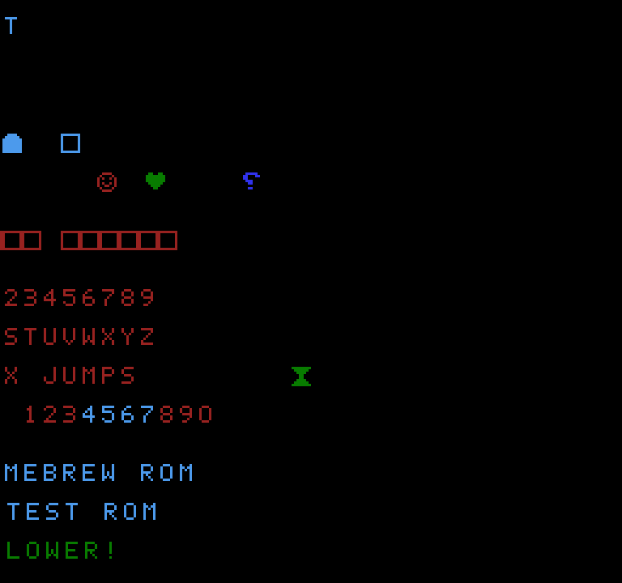
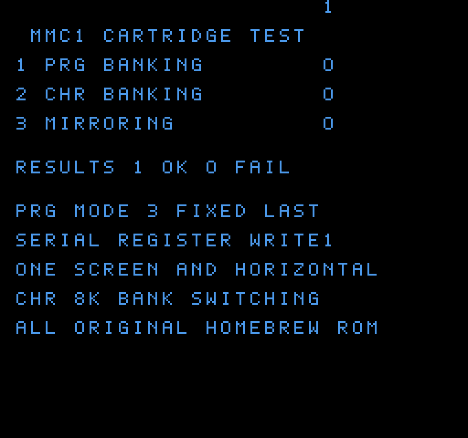

<div align="center">

# 🎮 NES on an STM32

**A Nintendo Entertainment System (the "Pegasus" of Polish living rooms)
emulated from scratch on a €40 microcontroller board — no operating
system, no emulator library, no shortcuts.**



*The picture above came out of the board's framebuffer over SWD, running
the self-test cartridge written for this project.*



*And this is an MMC1 cartridge — PRG banking, CHR banking and nametable
mirroring — running on the same board. Its frame is **pixel-identical**
to the reference emulator built for the PC.*

</div>

---

## What is this?

An NES emulator small enough to live on a **NUCLEO-L476RG** (Cortex-M4,
80 MHz, 96 KB of RAM) with an **X-NUCLEO-GFX01M2** display shield.

Everything is written from scratch in C:

- a **6502 CPU core** (the NES's processor, all official opcodes plus the
  undocumented ones real games use),
- a **PPU** — a scanline renderer for the picture chip: tiles, palettes,
  sprites, scrolling, sprite-0 hit, NMI,
- the **machine** around them: memory map with all the mirroring quirks,
  the cartridge (iNES), controller, OAM DMA,
- the **mappers** that switch banks while the game runs: NROM and MMC1
  (the chip in a large part of the NES library).

The self-test cartridge you see above is generated by this repository
too — its 8×8 font and artwork are drawn in Python, so the whole project
is original work.

## Why it is interesting

| Challenge | What had to happen |
|---|---|
| The NES draws 60 frames per second; the display link takes 12 ms per frame | the picture is streamed out in 8-scanline bands by DMA **while** the next band is being emulated |
| 128 KB of RAM, and the NES needs a framebuffer | an 8-bit indexed framebuffer holding the 64 NES colours, 61 KB of it |
| The CPU has to feel like a 1.79 MHz 6502 | a cycle-accurate core, paced per scanline (113.67 cycles per line) |
| Games change scroll registers mid-frame | the PPU renders one scanline at a time, exactly between the CPU's time slices |

**Current speed: ~18 frames per second** at full 256×240 resolution —
the emulation itself is correct, and the frame stream is verified
pixel-for-pixel against a reference build running on a PC (see
[docs/PERFORMANCE.md](docs/PERFORMANCE.md)).

## Layout

```
src/cpu6502.c      the 6502 core (dispatch generated by tools/gen_6502.py)
src/ppu.c          the picture chip: scanline renderer, sprites, scrolling
src/nes.c          the machine: bus, cartridge, controller, frame loop
src/lcd.c          landscape display, band streaming over SPI DMA
src/hal.c          the only file that touches hardware registers
src/rom_data.c     the cartridge, embedded (generated)
tools/             assembler, ROM generator, host test rigs
```

## Try it

You need the two boards and the Arm toolchain — everything else is in the
repository:

```bash
make            # builds the firmware with the self-test cartridge
make flash      # writes it to the board and resets
```

Then hold the board in landscape, USB sockets to the left — a quarter turn
counter-clockwise from the portrait hold mini-mario used. The joystick
turns with the board, so the emulator's map is the portrait one rotated 90°
(see [docs/ARCHITECTURE.md](docs/ARCHITECTURE.md#the-pad-inputc)): joystick
to move, the blue button is **A**, blue + down is **B**, blue + up is
**START**.

More detail in [docs/BUILD.md](docs/BUILD.md).

## The documentation

- [docs/ARCHITECTURE.md](docs/ARCHITECTURE.md) — how the emulator is put
  together, layer by layer, and how the two chips are kept in sync.
- [docs/BRINGUP.md](docs/BRINGUP.md) — the war stories. A DMA channel
  that could not double-buffer, a 4.6× too fast CPU, three bugs in my own
  test cartridge and one in the renderer — all with the fix.
- [docs/PERFORMANCE.md](docs/PERFORMANCE.md) — where the 54 ms of a frame
  actually go, and what was optimised (and what is next).

## Status

- [x] 6502 core, verified with a self-test program on the PC
- [x] PPU: background, sprites, scrolling, NMI, sprite-0 hit
- [x] NROM and MMC1 cartridges (MMC1: PRG/CHR banking, all four
      nametable arrangements), embedded in flash
- [x] Picture on the real panel, streamed by DMA
- [x] Joystick mapped to the NES controller
- [x] The hardware picture is verified against a PC reference frame
- [ ] MMC3 and later mappers
- [ ] Audio (the chip has a DAC; the shield has no speaker yet)
- [ ] Faster than 18 fps

## Licence

MIT — see [LICENSE](LICENSE). This project contains **no** third-party
code, artwork or ROM images: the test cartridge is generated from the
Python sources in `tools/`.

<div align="center">

*Built by Przemysław Batte. Long live the Pegasus.*

</div>
